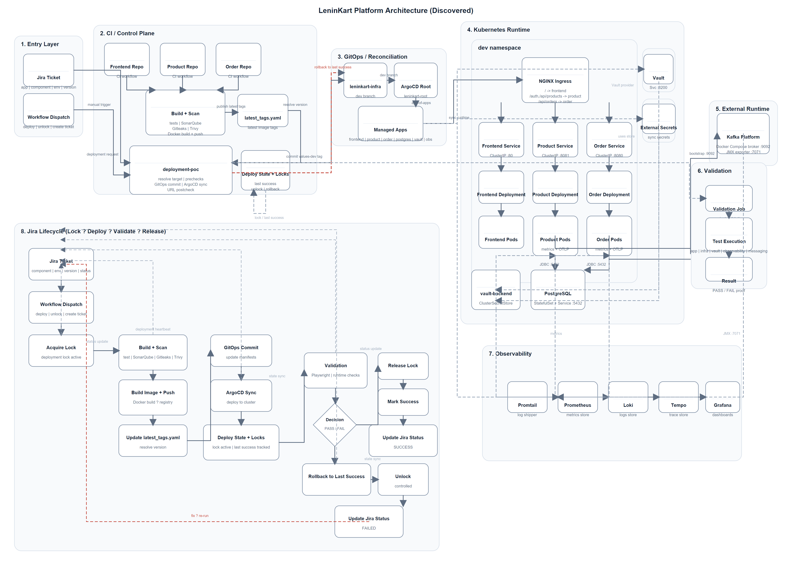

# LeninKart Platform Portfolio

This repository is the cleaned portfolio home for the LeninKart platform architecture, supporting docs, and reusable visual assets.

## Overview

LeninKart demonstrates a Jira-aware deployment control plane, GitOps-driven runtime delivery, Kubernetes workloads, validation proof, and observability-backed feedback.

## Architecture

- SVG source: [architecture/platform_architecture.svg](architecture/platform_architecture.svg)
- Architecture notes: [docs/architecture.md](docs/architecture.md)

## Jira Lifecycle

- Lifecycle notes: [docs/jira-lifecycle.md](docs/jira-lifecycle.md)

## GitOps Flow

- Deployment flow notes: [docs/deployment-flow.md](docs/deployment-flow.md)

## Observability

- Supporting screenshots: [assets/screenshots/observability](assets/screenshots/observability)

## Validation

- Validation reports: [docs/reports](docs/reports)
